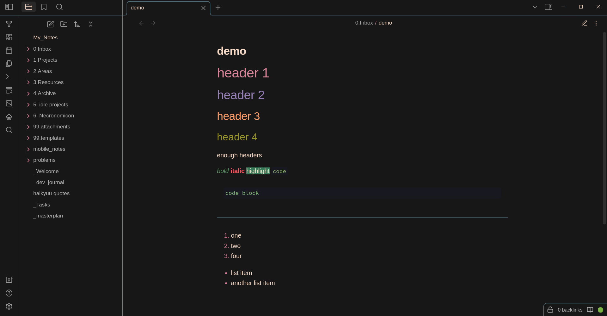

all credits to the [original author](https://github.com/sspaeti/obsidian_kanagawa)

i changed the colors of the background, headers, font, code, inline-code, bold, italic, highlighted text to suit my liking and make it easier on my eyes.

_Installation_: i don't know how to publish my theme to obsidian theme gallery, so just copy the css in here into `.obsidian` in your vault's directory and pray it takes effect

